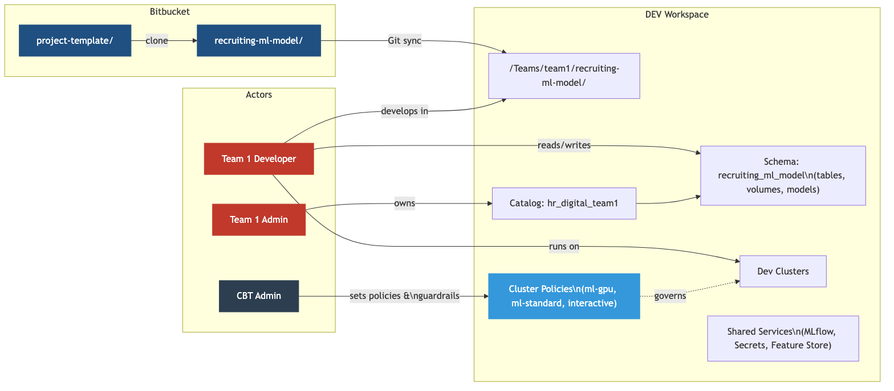
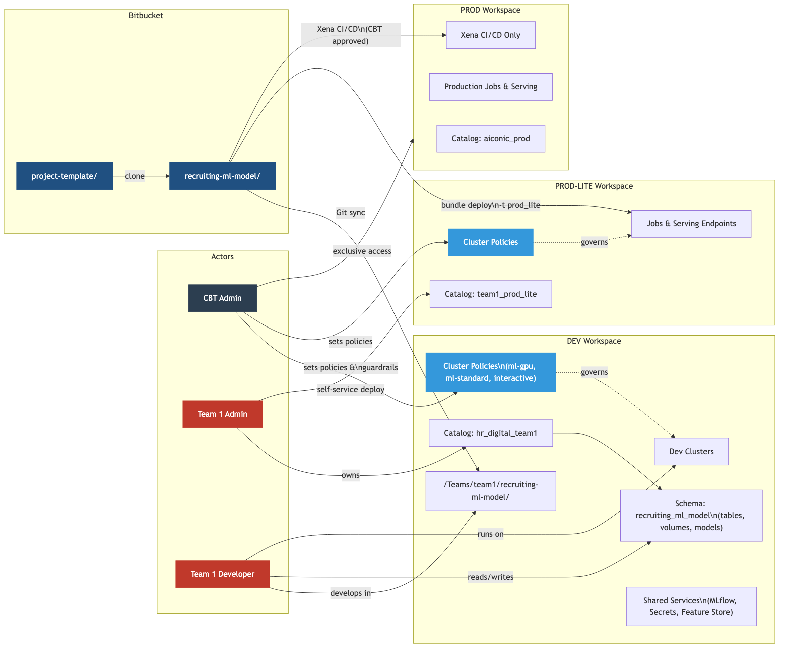

# AICONIC Platform - Databricks Workspace Design

## Problem Statement

AICONIC (J&J) needs a multi-tenant AI/ML platform that enables federated teams to independently develop, test, and deploy ML projects while maintaining centralized governance. The platform must support ~10 corporate teams running hundreds of projects, each tied 1:1 to a Bitbucket project folder and a target deployment. Teams need self-service capabilities in development and optional self-service deployment to production-lite environments, while a Central Business Technology (CBT) admin team maintains guardrails, cost controls, and exclusive access to the full production environment. Data isolation between teams is critical, with audit logging for any cross-boundary access. The platform must also provide shared services including experiment tracking, model registries, agent/MCP catalogues, and data catalogues accessible within the VPC.

---

## DEV Workspace Architecture



The DEV workspace is where teams do their day-to-day work. CBT sets cluster policies and guardrails; team admins own their catalog; developers work in Git-synced project folders and read/write to their project schema. Each additional team follows the same pattern with its own catalog, workspace folder, and cluster access.

See [aiconic-dev-view.mmd](aiconic-dev-view.mmd) for the raw Mermaid source.

### DEV Workspace Hierarchy

```
AICONIC-DEV Workspace
|
|-- [Catalog] hr_digital_team1
|   |-- [Schema] recruiting_ml_model          <-- 1:1 with Bitbucket project folder
|   |-- [Schema] _team1_shared                <-- Shared team datasets
|-- [Catalog] hr_digital_team2
|   |-- [Schema] employee_churn_ml_model      <-- 1:1 with Bitbucket project folder
|   |-- [Schema] _team2_shared
|-- [Catalog] aiconic_shared
|   |-- [Schema] reference_data
|   |-- [Schema] shared_feature_store
|-- [Folders] /Teams/hr_digital_team1/recruiting-ml-model/
|-- [Folders] /Teams/hr_digital_team2/employee-churn-model/
|-- [Policies] ml-standard, ml-gpu, interactive
|-- [Secrets] per-team scopes
```

### DEV Requirements & Databricks Solutions

| # | Requirement | Databricks Solution |
|---|-------------|---------------------|
| 1 | One project folder (Bitbucket) = one Unity Catalog schema | Each Bitbucket project folder maps 1:1 to a UC schema and a DAB bundle. |
| 2 | Projects include code, disk, compute, environment, secrets, data access | Git Folders (repos), Volumes, Cluster Policies, Init Scripts, Secret Scopes, UC grants. |
| 3 | Cost allocation by project | Custom tags on clusters/jobs/warehouses. Cluster policies enforce `project_id` tagging. Tags flow to cloud billing. |
| 4 | Teams spin up projects and compute without CBT | Team admins with delegated permissions. Cluster policies define allowed compute tiers. |
| 5 | Team admins manage their space but not others | UC catalog ownership delegated per team. Workspace folder ACLs isolate teams. |
| 6 | Per-project access control | UC schema-level grants + workspace folder ACLs per project. |
| 7 | CBT sets guardrails: compute limits, auto-shutoff | Cluster policies (instance types, max nodes, auto-termination), budget alerts. |
| 8 | CBT should not access team data; audit if they do | CBT excluded from team catalog grants. `system.access.audit` logs all access attempts. |
| 9 | ~10 teams, ~100s of projects | 1 catalog per team, N schemas per catalog. Scales naturally. |
| 10 | Preset environments | Cluster policies with fixed DBR versions + global init scripts per tier (`ml-standard`, `ml-gpu`). |
| 11 | Experiment tracking, model registry, data catalogue | MLflow Tracking, UC Model Registry, UC data cataloguing. Model Serving for MCP/agent endpoints. |

### DEV Groups & Access

| Group | DEV Access |
|-------|-----------|
| `cbt_admins` | Workspace admin (no team data access) |
| `team1_admins` | Own team1 catalog + folders |
| `team1_users` | Use team1 catalog + folders |
| `team2_admins` | Own team2 catalog + folders |
| `team2_users` | Use team2 catalog + folders |

---

## How to Create a Project

### Step 1: Create the Bitbucket Project Folder

Clone the AICONIC template and push as a new project folder:

```bash
git clone https://bitbucket.org/aiconic/project-template.git recruiting-ml-model
cd recruiting-ml-model
git remote set-url origin https://bitbucket.org/aiconic/recruiting-ml-model.git
git push -u origin main
```

The project folder name (`recruiting-ml-model`) becomes the canonical name used everywhere: the Bitbucket repo name, the UC schema name, the workspace folder name, and the DAB bundle name.

Template structure:

```
recruiting-ml-model/
|-- databricks.yml              # DAB config (bundle name, targets, variables)
|-- src/
|   |-- notebooks/              # Databricks notebooks
|   |-- python/                 # Python modules
|-- resources/
|   |-- jobs.yml                # Job definitions
|   |-- models.yml              # Model serving config
|-- tests/
```

### Step 2: Configure the Bundle

Edit `databricks.yml` with your project and team details:

```yaml
bundle:
  name: recruiting-ml-model

variables:
  team_catalog:
    default: hr_digital_team1
  project_schema:
    default: recruiting_ml_model
  cost_tag:
    default: "aiconic-team1-recruiting"

targets:
  dev:
    default: true
    workspace:
      host: https://aiconic-dev.cloud.databricks.com

resources:
  jobs:
    training_pipeline:
      name: "${bundle.name}_training"
      tasks:
        - task_key: train
          notebook_task:
            notebook_path: src/notebooks/train.py
          new_cluster:
            policy_id: "aiconic-ml-gpu"
            custom_tags:
              project: "${var.cost_tag}"
```

### Step 3: Deploy to DEV & Develop

```bash
databricks bundle validate
databricks bundle deploy --target dev
```

This creates:
- The workspace folder at `/Teams/<your-team>/recruiting-ml-model/`
- Jobs, clusters (governed by cluster policies), and other resources
- Git sync with the Bitbucket project folder

Develop using either:
- **Databricks UI** - edit notebooks directly, run on policy-governed clusters
- **Local IDE** - develop locally, push to Bitbucket, redeploy with `databricks bundle deploy`

Data access: read/write your schema (`hr_digital_team1.recruiting_ml_model`), read shared data (`aiconic_shared`).

---

## Example: Two HR Digital Teams

| | HR Digital Team 1 | HR Digital Team 2 |
|---|---|---|
| **Project** | Recruiting Candidate Prediction | Employee Churn Prediction |
| **Bitbucket Folder** | `recruiting-ml-model/` | `employee-churn-model/` |
| **DEV Schema** | `hr_digital_team1.recruiting_ml_model` | `hr_digital_team2.employee_churn_ml_model` |
| **Cluster Policy** | `ml-gpu` (training), `interactive` (EDA) | `ml-standard` (training), `interactive` (EDA) |
| **Cost Tag** | `aiconic-team1-recruiting` | `aiconic-team2-churn` |
| **Data Sources** | Candidate data, job postings, interview scores | Employee records, engagement surveys, exit interviews |
| **Model Output** | Candidate fit score (0-1) | Churn probability (0-1) |

---

## Deploying to Production

Once development is working in the DEV workspace, teams can promote their projects through PROD-LITE and PROD environments.

### Full Platform View (DEV + PROD-LITE + PROD)



See [aiconic-architecture-simple.mmd](aiconic-architecture-simple.mmd) for the raw Mermaid source.

### Additional Workspaces

```
AICONIC-PROD-LITE                       (Self-service deployment)
|-- [Catalog] hr_digital_team1_prod_lite
|-- [Catalog] hr_digital_team2_prod_lite
|-- [Policies] prod-lite-jobs, prod-lite-serving
|-- [Jobs] deployed via DAB per project

AICONIC-PROD                            (CBT-only, Xena CI/CD)
|-- [Catalog] aiconic_prod
|-- Access: CBT admins + service principals only

Shared Metastore spans all workspaces
|-- Lineage tracking enabled
```

### Production Requirements

| # | Requirement | Databricks Solution |
|---|-------------|---------------------|
| 1 | PROD-lite may or may not be isolated from Dev | Recommended: separate workspace. Alternative: logical isolation via UC + cluster policies. |
| 2 | Teams deploy to PROD-lite without CBT | DABs with pre-configured PROD-lite targets. Teams run `databricks bundle deploy -t prod_lite`. |
| 3 | Only CBT has access to PROD | Dedicated PROD workspace. Access restricted to CBT admins + CI/CD service principals. |
| 4 | Cost allocation spans dev and prod | Same `project_id` tag used across all workspaces. Tags flow to cloud billing. |

### Production Groups & Access

| Group | DEV | PROD-LITE | PROD |
|-------|-----|-----------|------|
| `cbt_admins` | Workspace admin (no team data) | Workspace admin | Full admin |
| `team1_admins` | Own team1 catalog + folders | Deploy to team1 catalog | No access |
| `team1_users` | Use team1 catalog + folders | Read-only | No access |
| `team2_admins` | Own team2 catalog + folders | Deploy to team2 catalog | No access |
| `team2_users` | Use team2 catalog + folders | Read-only | No access |
| `cicd_sp` | Read repos | Deploy jobs | Deploy jobs |

### Adding PROD-LITE and PROD Targets to the Bundle

Add deployment targets to `databricks.yml`:

```yaml
targets:
  dev:
    default: true
    workspace:
      host: https://aiconic-dev.cloud.databricks.com

  prod_lite:
    workspace:
      host: https://aiconic-prod-lite.cloud.databricks.com

  prod:
    workspace:
      host: https://aiconic-prod.cloud.databricks.com
    run_as:
      service_principal_name: "cicd_sp"
```

### Deploy to PROD-LITE (Self-Service)

Teams deploy directly without CBT:

```bash
databricks bundle deploy --target prod_lite
```

Or automate via Bitbucket Pipelines:

```yaml
# bitbucket-pipelines.yml
pipelines:
  branches:
    main:
      - step:
          name: Deploy to PROD-LITE
          script:
            - pip install databricks-cli
            - databricks bundle deploy --target prod_lite
```

### Promote to PROD (CBT-Managed)

1. Team raises a deployment request (e.g., Jira ticket to CBT).
2. CBT reviews and approves.
3. Xena CI/CD pipeline runs `databricks bundle deploy --target prod`.
4. Only the `cicd_sp` service principal can deploy to PROD.

### Production Example: Two HR Digital Teams

| | HR Digital Team 1 | HR Digital Team 2 |
|---|---|---|
| **PROD-LITE Schema** | `hr_digital_team1_prod_lite.recruiting_ml_model` | `hr_digital_team2_prod_lite.employee_churn_ml_model` |
| **PROD Schema** | `aiconic_prod.recruiting_ml_model` | `aiconic_prod.employee_churn_ml_model` |
| **Serving** | Batch scoring via scheduled job | Real-time endpoint via Model Serving |

---

## Auditing

Databricks `system.access.audit` system tables record all access events across workspaces. CBT should monitor for:

- **Cross-team data access** — any CBT admin or user accessing a team catalog they are not a member of
- **Permission changes** — grants or revocations on catalogs, schemas, tables, or volumes
- **Cluster policy overrides** — attempts to create clusters outside of approved policies
- **Secret scope access** — reads of team secret scopes by non-team members
- **PROD workspace access** — all login and API activity in the production workspace
- **Data exports** — downloads or external transfers of sensitive team data
